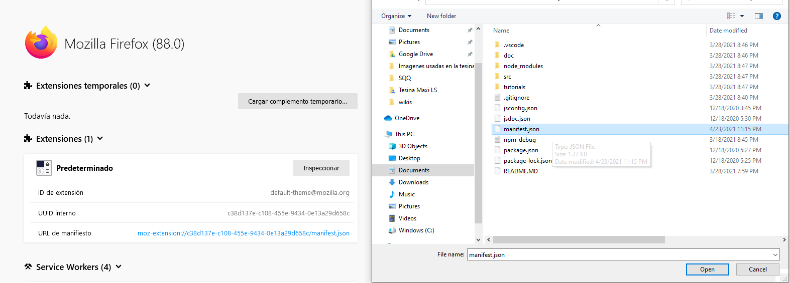
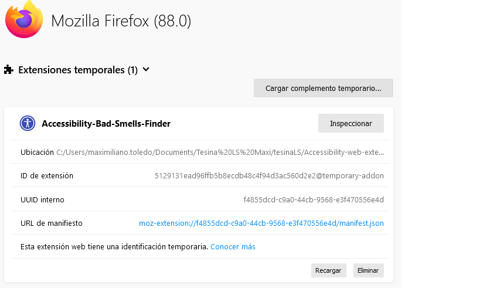
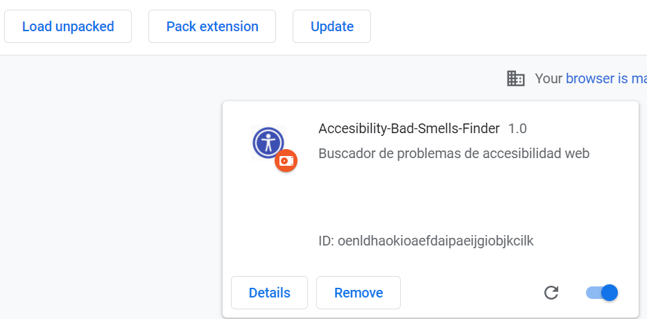
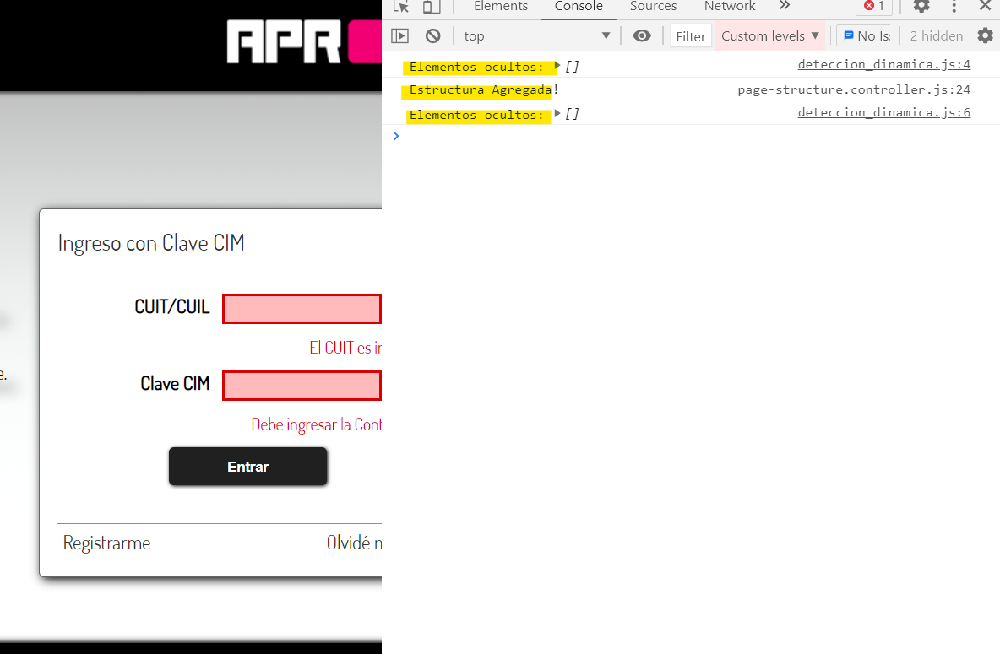

# Extension Web
La extensión web de ABF es la encargada de detectar elementos web que generen algún tipo de accessibility smell.

### Instalación 🔧
Para instalar la extensión web en nuestro navegador, primero necesitamos descargar o clonar su código fuente del repositorio.

Una vez descargado, podremos comenzar con la instalación en el web browser. Para este trabajo se pudo determinar que la extensión funciona
correctamente tanto para **Mozilla Firefox** como para **Google Chrome**.

La forma de instalación en estos web browsers es la siguiente:

#### Para Mozilla Firefox
Debemos entrar a la siguiente url:
```
about:debugging#/runtime/this-firefox
```


```
Figura 1: Cargar extensiones temporales en Firefox.
```

Como vemos en la Figura 1 podremos instalar extensiones temporales. Seleccionamos “Cargar complemento temporario” y seleccionamos el
archivo manifest.json de nuestra extensión web.

Esto instalará la extensión web “Accessibility-BadSmells-Finder”, Figura 2, la cual ya estará reportando una vez que ingresemos a un sitio web.


```
Figura 2: Web extension instalada.
```

#### En Google Chrome

Debemos entrar a la siguiente url dentro del browser:
```
chrome://extensions/
```

Luego, como vemos en la Figura 3, debemos seleccionar “Load unpacked” (paso #1). Nos pedirá seleccionar la carpeta donde se encuentra el
código fuente de la extensión web (paso #2).


```
Figura 3: Cargar extensiones temporales en Chrome.
```

Luego de esto, la instalación de la extensión ya estará completada, Figura 4.


```
Figura 4: Extensión web instalada correctamente en Chrome.
```


Para validar si la extensión está funcionando, se puede comprobar en la consola del navegador los logs que la misma va logeando: ejemplo en la
Figura 5.


```
Figura 5: Ejemplo de los logs que va generando la extensión web del a herramienta de detección.
```

### Nota 📋
Por defecto la extensión web está configurada para ejecutarse en cualquier sitio web, pero esto se puede restringir a páginas web especificas
en la sección “matches” del archivo manifest.json.

## JSDoc 📌
```
npm install
```

#### JSDoc, Documentacion en Javascript
```
npm run docs >>> genera la documentacion
```
