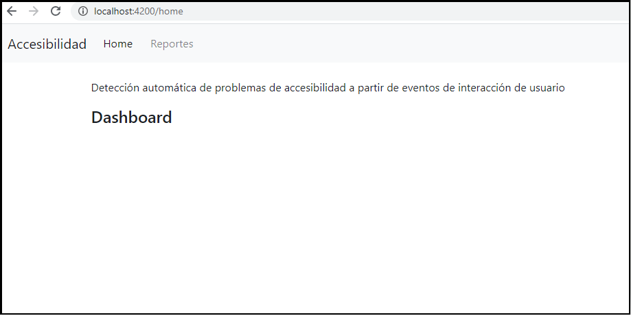

# AppReportesTesina
La Aplicacion de Reportes de ABF es una UI en la cual tanto el propietario del sitio web como los desarrolladores pueden visualizar si su aplicación contiene algún accessibility smell.

Para tener el entorno completo de la herramienta en ejecución, debemos tener la aplicación de reportes instalada y ejecutándose para lograr visualizar el resultado final expresado en un reporte.

### Pre-requisitos 📋
Tener instalado Angular CLI
[Angular CLI](https://angular.io/guide/setup-local): versión 10.2.1

### Instalación 🔧
Para tener en funcionamiento la APP de Reportes, primero necesitamos descargar o clonar su código fuente del repositorio.

1. Abrir una consola de sistema en la carpeta donde descargamos su código fuente.
2. En la consola ejecutar el comando **npm install** para descargar todas sus dependencias.
3. Una vez que termine la instalación, podremos ejecutar la aplicación de reportes con el comando **ng serve**

Para visualizar la aplicación debemos ingresar a `http://localhost:4200/` en cualquier navegador web, como se observa en la Figura 1.


```
Figura 1: Ingresando a la Aplicación de reportes a través del navegador web.
```


### Sobre Angular CLI 🚀
This project was generated with [Angular CLI](https://github.com/angular/angular-cli) version 10.2.0.

#### Node Version
version 12.14.0

#### Development server

Run `ng serve` for a dev server. Navigate to `http://localhost:4200/`. The app will automatically reload if you change any of the source files.

#### NG GENERATE

`ng g module components/pages/home -m=app --route home`
generar un modulo en la carpeta component, crear home, indicar en que modulo lo queremos (app), indicamos que nos cree una ruta que se llame `home` ya que estamos generando un nuevo modulo.

`ng g c components/posts/new-post -m=app`
generar component en esa carpeta post, y va a estar en el modulo principal.

`ng g s components/posts/post --flat`
generar un servicio, flat para no crear nueva carpeta

#### Bootstrap Angular widgets and components 
https://ng-bootstrap.github.io/#/home